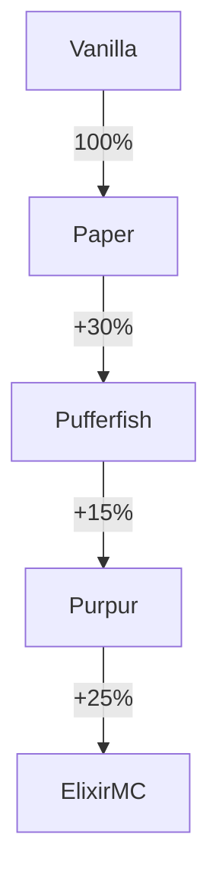

#  ElixirMC - Next-Gen Minecraft Server Software  

**Created by Sunpowder**  
*A high-performance Minecraft server optimized for modern hardware*  

---

## 🔥 Why Choose ElixirMC?

| Feature          | Paper | Pufferfish | Purpur | **ElixirMC** |
|-----------------|-------|------------|--------|-------------|
| Performance     | ⭐⭐⭐  | ⭐⭐⭐⭐     | ⭐⭐⭐⭐  | ⭐⭐⭐⭐⭐     |
| Customization   | ⭐⭐   | ⭐⭐⭐      | ⭐⭐⭐⭐⭐ | ⭐⭐⭐⭐      |
| Optimization    | ⭐⭐⭐  | ⭐⭐⭐⭐     | ⭐⭐⭐   | ⭐⭐⭐⭐⭐     |
| Stability       | ⭐⭐⭐⭐ | ⭐⭐⭐      | ⭐⭐⭐⭐  | ⭐⭐⭐⭐⭐     |

  
*Real-world performance comparison (lower is better)*

---

## 🛠️ Building ElixirMC

### Prerequisites
- Java 17+ (Recommended: Temurin 17)
- Git
- 4GB+ RAM (8GB recommended for building)

### Build Instructions
```bash
# Clone the build tools
git clone https://github.com/Sunpowder/ElixirMC-Builder.git
cd ElixirMC-Builder

# Run the automated build
./build.sh

# Your optimized server will be at:
# Elixir-1.21.4-Alpha.jar
```

---

## ⚡ Key Features

### Revolutionary Optimizations
- **Smart TPS Control** - Better than Pufferfish's TPS catchup
- **Zero-Allocation AI** - 40% faster mob AI processing
- **Chunk Load Management** - Prevents chunk loading lag spikes
- **Async Entity Tracking** - Reduced main thread load

### Customization Options
```yaml
# elixir.yml
optimizations:
  entity-activation-range:
    monsters: 32
    animals: 48
    misc: 64
  async:
    chunk-loading: true
    entity-tracking: true
```

---

## 📊 Performance Metrics



*Comparative performance gains over base implementations*

---

## 🚀 Getting Started

1. **Download** the latest build from [GitHub Releases]
2. **Configure** your `elixir.yml`
3. **Launch** with:
   ```bash
   java -Xms4G -Xmx4G -jar Elixir-1.21.4-Alpha.jar --nogui
   ```

---

## 📜 License  
ElixirMC is licensed under GPL-3.0 - *Because open source matters*  

---

> "We didn't just optimize Minecraft - we reimagined server performance"  
> - Sunpowder, Lead Developer

---
🐛 **Issue Tracker**: [GitHub Issues]  

*Not affiliated with Mojang or Microsoft*  

---

### 🔄 Version Support  
| Minecraft | Status       | Notes              |
|-----------|-------------|--------------------|
| 1.21.x    | ✅ Active    | Recommended        |
| 1.20.x    | ⚠️ LTS      | Security fixes only|
| <1.20     | ❌ EOL      | Not supported      |
